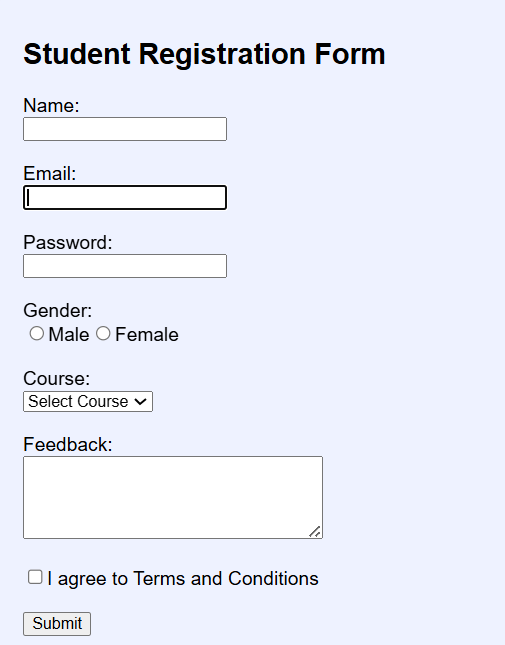

# React Forms Practice 🚀

A React application built to learn and practice React Forms using controlled components and React Hooks.

## Features

* Text Input Field
* Email Input Field
* Password Input Field
* Radio Buttons
* Checkbox
* Select Dropdown
* Textarea
* Form Validation
* Form Submission Handling
* Live Data Preview

## Concepts Learned

### useState Hook

Used the `useState` hook to manage form data and update the UI dynamically.

### Controlled Components

Managed all form inputs through React state to maintain a single source of truth.

### Event Handling

Used `onChange` and `onSubmit` events to capture user interactions and process form data.

### Form Validation

Validated required fields before allowing form submission.

### Radio Buttons

Implemented gender selection using radio buttons and state management.

### Checkbox Handling

Used checkboxes to accept terms and conditions and handled boolean values using `checked`.

### Select Dropdown

Allowed users to select a course from a dropdown menu.

### Textarea

Collected user feedback using a textarea component.

### Dynamic State Updates

Updated multiple form fields using a single `handleChange` function and computed property names.

## Project Structure

src/
├── App.js
├── login_page.js
└── App.css

## Form Fields

* Name
* Email
* Password
* Gender
* Course
* Feedback
* Terms and Conditions

## Screenshot

## How to Run

npm install

npm start

Open:

http://localhost:3000

## Future Improvements

* Add Password Strength Validation
* Add Form Reset Functionality
* Store Data in Local Storage
* Connect Form with Backend API
* Display Submitted Records in a Table

